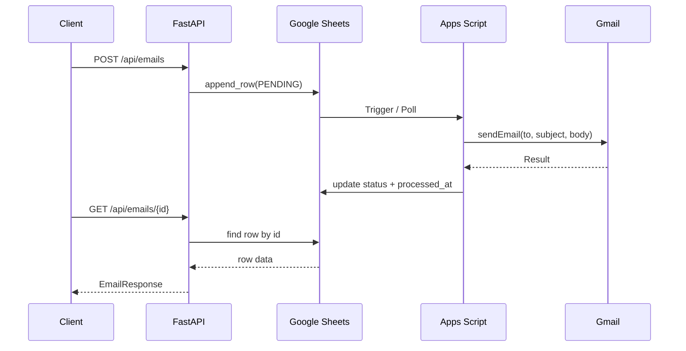
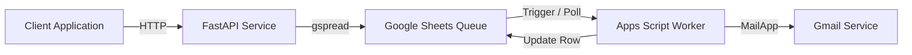

# Sheety Email Service

## Introduction

A lightweight local email sending service leveraging Google Sheets as a queue.
It decouples API requests from email delivery using Apps Script as a background worker.

## Installation

### 1. Google Sheets Setup

1. Create a new spreadsheet in Google Sheets
2. Name the spreadsheet however you want
3. Rename the worksheet however you want

### 2. Google Cloud Console Setup

#### Create Project

1. Go to https://console.cloud.google.com/
2. Create a new project

#### Enable APIs

Enable the following APIs:

* Google Sheets API
* Google Drive API

#### Create Service Account

1. Navigate to IAM & Admin → Service Accounts
2. Create a new service account
3. Assign a name (e.g., `sheety-email-service`)
4. Complete creation (no roles required)

#### Generate Credentials

1. Open the service account
2. Go to the **Keys** tab
3. Click **Add Key → Create new key**
4. Select **JSON**
5. Download the file and rename it:

   ```
   credentials.json
   ```

#### Share Spreadsheet

1. Open your Google Sheet
2. Click **Share**
3. Add the service account email:

   ```
   your-service-account@project-id.iam.gserviceaccount.com
   ```
4. Grant **Editor** permissions


### 3. Google Apps Script Setup

1. Open the spreadsheet
2. Navigate to **Extensions → Apps Script**
3. Add the script [sheet.trigger.gs](./sheet.trigger.gs):
4. Configure trigger:
   * Function: `onChange`
   * Deployment: `cap`
   * Event Source: `From Spreadsheet`
   * Event Type: `On Change`


### 4. Python Backend Setup

#### Create a virtual environment (optional but recomended)

```bash
virtualenv .venv
source .venve/bin/activate # or on windows .\venv\Scripts\activate
```

#### Install dependencies

```bash
pip install -r requirements.txt
```

#### Create a .env with the following variables

```bash
SPREADSHEET_NAME=
WORKSHEET_NAME=
```


#### Project structure

```
project/
├── credentials.json
├── .env
├── main.py
├── readme.md
├── requirements.txt
└── sheet.trigger.gs
```

#### Run the server

```bash
fastapi run main.py
```

> [!NOTE]
> Swagger is accessible at http://localhost:8000/docs

## Conceptual Architecture

### Sequence Diagram




### Component Diagram


